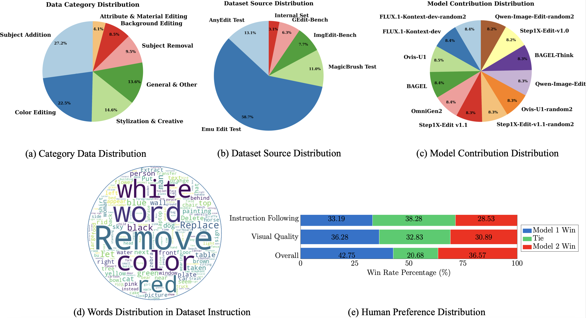

<p align="center" width="100%">

</p>

<div align="center">

# EditReward: A Human-Aligned Reward Model for Instruction-Guided Image Editing

[](https://github.com/TIGER-AI-Lab/EditReward)
[](https://arxiv.org/abs/2509.26346)
[](https://huggingface.co/TIGER-Lab/EditReward)
[](https://huggingface.co/datasets/TIGER-Lab/EditReward-Data)
[](https://huggingface.co/datasets/TIGER-Lab/EditReward-Bench)
</div>


## 📖 Introduction

This is the official implementation for the paper: [EditReward: A Human-Aligned Reward Model for Instruction-Guided Image Editing](https://arxiv.org/abs/2508.03789).
In this paper, we introduce **EditReward**, a human-aligned reward model powered by a high-quality dataset for instruction-guided image editing. We first construct **EditReward-Data**, a large-scale, high-fidelity preference dataset for instruction-guided image editing. It comprises over 200K manually annotated preference pairs, covering a diverse range of edits produced by seven state-of-the-art models across twelve distinct sources. Every preference annotation in **EditReward-Data** was curated by trained annotators following a rigorous and standardized protocol, ensuring high alignment with considered human judgment and minimizing label noise. Using this dataset, we train the reward model **EditReward** to score instruction-guided image edits. To rigorously assess **EditReward** and future models, we also introduce **EditReward-Bench** a new benchmark built upon our high-quality annotations, which includes more difficult multi-way preference prediction.

<p align="center">
  
</p>


## 📰 News
- **[2025-10-01]** 🎉 We initialize the official repo of EditReward.

<!-- TODO List -->
## 🚧 TODO List
- [ ] Release inference code and pretrained model
- [ ] Release evaluation benchmark
- [ ] Release training code
- [ ] Release training dataset

## 📄 Table of Contents
- [🛠️ Installation](#%EF%B8%8F-installation-)
- [👨‍🏫 Get Started](#-get-started-)
- [🏋️ Training](#🏋️-training)
- [📊 Benchmark](#📊-benchmark)
- [🖊️ Citation](#%EF%B8%8F-citation-)
- [🤝 Acknowledgement](#-acknowledgement-)
- [🎫 License](#-license-)

---

## 🚀 Quick Start

EditReward is a VLM-based reward model trained on EditReward-Data that demonstrates superior alignment with human preferences.

### 💻 Installation

<!-- # Method 1: Pypi download and install for inference.
pip install hpsv3 -->

```bash

git clone https://github.com/TIGER-AI-Lab/EditReward.git
cd EditReward

conda create -n edit_reward python=3.10 -y
conda activate edit_reward
pip install torch==2.5.1 torchvision==0.20.1 torchaudio==2.5.1 --index-url https://download.pytorch.org/whl/cu124
pip install datasets pillow openai -U megfile sentencepiece deepspeed fire omegaconf matplotlib peft trl==0.8.6 tensorboard scipy transformers==4.56.1 accelerate
# Recommend: Install flash-attn
pip install https://github.com/Dao-AILab/flash-attention/releases/download/v2.7.2.post1/flash_attn-2.7.2.post1+cu12torch2.5cxx11abiFALSE-cp310-cp310-linux_x86_64.whl

```


### 🚀 Usage

#### Basic Command

```python
from EditReward import EditRewardInferencer

# Initialize the model
inferencer = EditRewardInferencer(device='cuda')

# Evaluate images
image_paths = ["assets/example1.png", "assets/example2.png"]
prompts = [
  "cute chibi anime cartoon fox, smiling wagging tail with a small cartoon heart above sticker",
  "cute chibi anime cartoon fox, smiling wagging tail with a small cartoon heart above sticker"
]

# Get preference scores
rewards = inferencer.reward(prompts, image_paths=image_paths)
scores = [reward[0].item() for reward in rewards]  # Extract mu values
print(f"Image scores: {scores}")
```

---


## 📁 Dataset

### EditReward-Data
work in progress
<p align="left">
  
</p>
<!-- <details close> -->

### Download EditReward
<!-- ```
HPDv3 is comming soon! Stay tuned!
``` -->
```bash
huggingface-cli download --repo-type dataset TIGER-Lab/EditReward-Data --local-dir /your-local-dataset-path
```

## 🏋️ Training

### 🚀 Training Command

work in progress

```bash
```

---

## 📊 Benchmark
To evaluate **EdiReward preference accuracy**, follow the detail instruction is in [Evaluate Insctruction](evaluate/README.md)
work in progress

<details open>

<summary> Experimental Results: Alignment with Humans </summary>

| Method | GenAI-Bench | AURORA-Bench | ImagenHub | EditReward-Bench (Overall) |
| :--- | :--- | :--- | :--- | :--- |
| Random | 25.90 | 33.43 | -- | 13.84 |
| Human-to-Human | -- | -- | 41.84 | -- |
| ***Proprietary Models*** | | | | |
| GPT-4o | 53.54 | 50.81 | 38.21 | 28.31 |
| GPT-5 | 59.61 | 47.27 | <u>40.85</u> | 37.81 |
| Gemini-2.0-Flash | 53.32 | 44.31 | 23.69 | 33.47 |
| Gemini-2.5-Flash | 57.01 | 47.63 | **41.62** | <u>38.02</u> |
| ***Open-Source VLMs*** | | | | |
| Qwen2.5-VL-3B-Inst | 42.76 | 30.69 | -2.54 | 26.86 |
| Qwen2.5-VL-7B-Inst | 40.48 | 38.62 | 18.59 | 29.75 |
| Qwen2.5-VL-32B-Inst | 39.28 | 37.06 | 26.87 | 28.72 |
| MiMo-VL-7B-SFT-2508 | 57.89 | 30.43 | 22.14 | 31.19 |
| ADIEE | 59.96 | 55.56 | 34.50 | -- |
| ***Reward Models (Ours)*** | | | | |
| EditReward (on Qwen2.5-VL-7B) | <u>63.97\</u> | <u>59.50</u> | 36.18 | 36.78 |
| EditReward (on MiMo-VL-7B) | **65.72** | **63.62** | 35.20 | **38.42** |
</details>

---

<details open>

<summary> EditReward-Bench Results </summary>

| Method | EditReward-Bench (K=2) | EditReward-Bench (K=3) | EditReward-Bench (K=4) | EditReward-Bench (Overall) |
| :--- | :--- | :--- | :--- | :--- |
| Random | 25.81 | 11.33 | 1.35 | 13.84 |
| Human-to-Human | -- | -- | -- | -- |
| ***Proprietary Models*** | | | | |
| GPT-4o | 45.69 | 27.33 | 7.31 | 28.31 |
| GPT-5 | <u>57.53\</u> | 38.51 | <u>12.84\</u> | 37.81 |
| Gemini-2.0-Flash | 52.43 | 33.33 | **13.51** | 33.47 |
| Gemini-2.5-Flash | **58.61** | <u>39.86\</u> | 12.16 | <u>38.02\</u> |
| ***Open-Source VLMs*** | | | | |
| Qwen2.5-VL-3B-Inst | 51.07 | 20.27 | 2.71 | 26.86 |
| Qwen2.5-VL-7B-Inst | 52.69 | 24.67 | 3.38 | 29.75 |
| Qwen2.5-VL-32B-Inst | 50.54 | 25.27 | 4.05 | 28.72 |
| MiMo-VL-7B-SFT-2508 | 49.46 | 30.41 | 9.46 | 31.19 |
| ADIEE | -- | -- | -- | -- |
| ***Reward Models (Ours)*** | | | | |
| EditReward (on Qwen2.5-VL-7B) | 56.99 | 36.00 | 10.81 | 36.78 |
| EditReward (on MiMo-VL-7B) | 56.45 | **42.67** | 11.49 | **38.42** |
</details>

---


## 📚 Citation

Please kindly cite our paper if you use our code, data, models or results:

```bibtex

```


---

## 🙏 Acknowledgements

We would like to thank the [HPSv3](https://github.com/MizzenAI/HPSv3) and [VideoAlign](https://github.com/KwaiVGI/VideoAlign) codebase for providing valuable references.

---
## ⭐ Star History [🔝](#-table-of-contents)

[](https://star-history.com/#TIGER-AI-Lab/EditReward&Date)
## 💬 Support

For questions and support:
- **Issues**: [GitHub Issues](https://github.com/MizzenAI/HPSv3/issues)
- **Email**: yhshui@mizzen.ai & yhma@mizzen.ai